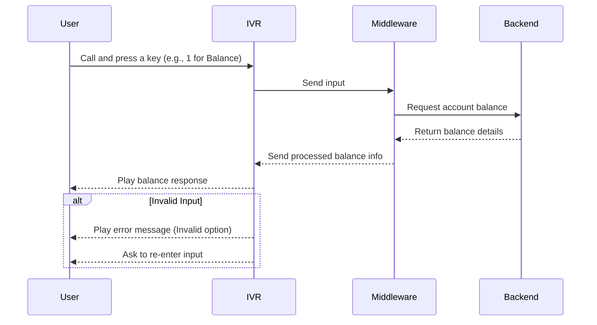

<b>
# TeamB-IVR-Modernization

## Overview

This project focuses on modernizing a legacy VXML-based IVR system into a smarter, scalable solution.

The new IVR integrates with Azure Communication Services (ACS) ☁️ and Bot Application Platform (BAP) 🤖 to provide a seamless customer experience. 

It supports both voice 🎙️ and keypad inputs ⌨️, enabling faster, more intelligent, and user-friendly interactions.


###  Purpose of the Project

The purpose of this project is to modernize an IVR (Interactive Voice Response) system so that it becomes faster, smarter, and easier for users to interact with.
A modern IVR helps businesses improve customer experience, reduce wait times, and handle requests more efficiently without needing human support every time.

###  What is IVR?

IVR (Interactive Voice Response) is an automated phone system that allows users to interact with a computer using voice or keypad inputs.
Example: When you call a bank and hear “Press 1 for Balance, Press 2 for Transactions” — that is an IVR system.
It connects the user with the backend systems through voice menus, without requiring a live agent for every request.

###  Why Modernization is Needed?

Traditional IVR systems are often slow, outdated, and frustrating for users.
They have long menus, making users press many keys before reaching what they need.
They are not smart — they can’t easily handle errors, voice inputs, or connect smoothly with new digital services.
They increase customer dissatisfaction and support costs.

###  Modernization makes IVR better by:

- Adding smarter workflows and shorter menus

-  Supporting voice recognition along with keypad inputs

-  Connecting with modern backend systems (APIs, databases, cloud)

- Giving faster, clearer, and more accurate responses to users

##  System Architecture

#### IVR (Interactive Voice Response) :
Handles incoming calls, plays prompts, and collects user input.

#### Middleware : 
Connects IVR with backend services. It processes requests and communicates with APIs.

####  Backend : Stores account or business data and responds to middleware requests.

#### ACS (Azure Communication Services) : 
Provides modern communication channels like voice, SMS, and chat.

#### BAP (Bot Application Platform) : 
Ads conversational AI to understand natural language and automate workflows.

##  Sequence Diagram



##  Explanation
The sequence diagram shows how the IVR system works:
1. The **User** calls and gives input to the **IVR**.
2. The **IVR** sends the input to the **Middleware**.
3. The **Middleware** processes the request by contacting the **Backend**.
4. The **Backend** sends back the response to the **Middleware**.
5. The **Middleware** returns the processed information to the **IVR**.
6. Finally, the **IVR** provides the response back to the **User**.

This flow ensures smooth communication between the user and backend through the IVR system.
##  Usage Flow

The IVR system follows a structured flow to ensure smooth user interaction:
1. Call Initiation → A user dials into the IVR system.

2. Greeting & Menu → The IVR welcomes the user and presents options (e.g., Press 1 for Balance, Press 2 for Support).

3. User Input → Input is captured through keypad (DTMF) or voice recognition (ASR).

4. Middleware Processing → The input is forwarded to the middleware, which validates and routes the request.

5. Backend Query → The backend retrieves the required data (e.g., balance details) from the database or service.

6. Response Formatting → Middleware processes the backend response into a user-friendly message.

7. IVR Playback → The IVR communicates the result back to the user via text-to-speech or pre-recorded prompts.

8. Session Completion → The user either ends the call or navigates back for additional actions.
##  Error Handling

- To ensure reliability, the IVR system includes robust error-handling mechanisms:

- Invalid Input → If the user presses an unsupported key or says an unrecognized phrase, the IVR plays an error message and prompts again.

- Retry Limit → The user can retry up to 3 times before the system transfers to a live agent (if available) or ends the call.

- No Input / Timeout → If the user does not respond within a set time, the IVR repeats the prompt or ends the session politely.

- Backend Failure → If the backend is unavailable, the middleware returns a fallback response (“Service is temporarily unavailable, please try again later”).

- Logging & Monitoring → All invalid attempts and system errors are logged for monitoring, analysis, and improvement.
  
  ##  Setup
  
1. Clone the repository.
2. Install dependencies for each module (IVR, middleware, backend).
3. Configure environment variables (e.g., API keys, database credentials).
4. Run backend server.
5. Run middleware service.
6. Deploy or simulate IVR using a platform like Twilio or Asterisk.
7. Test the flow using provided test cases.
##  Error Handling Flowchart
  ```mermaid
flowchart TD
    A[Start: User Input] --> B{Valid Input?}
    B -- Yes --> C[Send to Middleware]
    C --> D[Process Request]
    D --> E[Return Response to User]
    E --> F[End Call]

    B -- No --> G[Play Error Message]
    G --> H{Retry Attempts Left?}
    H -- Yes --> A
    H -- No --> I{Agent Available?}
    I -- Yes --> J[Transfer to Live Agent]
    I -- No --> K[End Call]
```
##  Conclusion

This project shows how modernizing legacy VXML-based IVR systems can greatly improve communication between users and backend services. By integrating with modern platforms like ACS and BAP, the IVR becomes more flexible, supports both voice and keypad inputs, and delivers smarter, faster, and more accurate responses. This modernization not only reduces customer frustration but also makes the system scalable, cost-effective, and future-ready.
</b>
