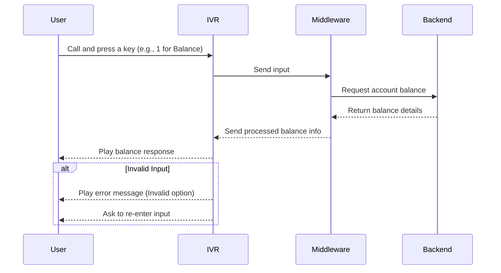

# TeamB-IVR-Modernization
## Documentation

## 📖 Overview

This project focuses on modernizing a legacy VXML-based IVR system into a smarter, scalable solution.

The new IVR integrates with Azure Communication Services (ACS) ☁️ and Bot Application Platform (BAP) 🤖 to provide a seamless customer experience. 

It supports both voice 🎙️ and keypad inputs ⌨️, enabling faster, more intelligent, and user-friendly interactions.

### Purpose of the Project

The purpose of this project is to modernize an IVR (Interactive Voice Response) system so that it becomes faster, smarter, and easier for users to interact with.
A modern IVR helps businesses improve customer experience, reduce wait times, and handle requests more efficiently without needing human support every time.

### 📌 What is IVR?

IVR (Interactive Voice Response) is an automated phone system that allows users to interact with a computer using voice or keypad inputs.
Example: When you call a bank and hear “Press 1 for Balance, Press 2 for Transactions” — that is an IVR system.
It connects the user with the backend systems through voice menus, without requiring a live agent for every request.

### ☎️ Why Modernization is Needed?

Traditional IVR systems are often slow, outdated, and frustrating for users.
They have long menus, making users press many keys before reaching what they need.
They are not smart — they can’t easily handle errors, voice inputs, or connect smoothly with new digital services.
They increase customer dissatisfaction and support costs.

### 🔄 Modernization makes IVR better by:
✅Adding smarter workflows and shorter menus

✅ Supporting voice recognition along with keypad inputs

✅ Connecting with modern backend systems (APIs, databases, cloud)

✅ Giving faster, clearer, and more accurate responses to users

## 🏗️ System Architecture

IVR (Interactive Voice Response) ☎️: Handles incoming calls, plays prompts, and collects user input.

## Middleware 🔄: Connects IVR with backend services. It processes requests and communicates with APIs.

## Backend 🖥️: Stores account or business data and responds to middleware requests.

## ACS (Azure Communication Services) ☁️: Provides modern communication channels like voice, SMS, and chat.

## BAP (Bot Application Platform) 🤖: Adds conversational AI to understand natural language and automate workflows.

## 🖼️ Introduction to sequence diagram
The following section explains how different parts of the IVR system interact with each other.  
We use a **sequence diagram** to show the step-by-step flow of communication between:  

- **User** → the person making the call  
- **IVR** → the Interactive Voice Response system that takes input  
- **Middleware** → the layer that processes and forwards requests  
- **Backend** → the system that provides data and final responses  

## 📊 Sequence Diagram

## 📝 Explanation
The sequence diagram shows how the IVR system works:
1. The **User** calls and gives input to the **IVR**.
2. The **IVR** sends the input to the **Middleware**.
3. The **Middleware** processes the request by contacting the **Backend**.
4. The **Backend** sends back the response to the **Middleware**.
5. The **Middleware** returns the processed information to the **IVR**.
6. Finally, the **IVR** provides the response back to the **User**.

This flow ensures smooth communication between the user and backend through the IVR system.
## ✅ Conclusion

This project shows how modernizing legacy VXML-based IVR systems can greatly improve communication between users and backend services. By integrating with modern platforms like ACS and BAP, the IVR becomes more flexible, supports both voice and keypad inputs, and delivers smarter, faster, and more accurate responses. This modernization not only reduces customer frustration but also makes the system scalable, cost-effective, and future-ready.
