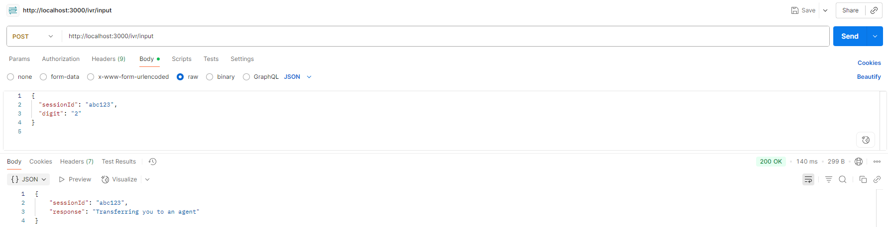
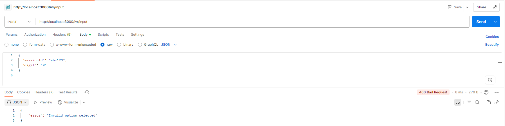

# API Documentation: IVR Endpoints

## 1. Overview
This middleware serves as the main entry point for the IVR (Interactive Voice Response) system. It receives user inputs (digits) and routes them to the appropriate backend service for processing.

### ACS : 
Handles requests for account balance (digit: "1") and agent transfers (digit: "2").

### BAP : 
Handles requests for the payment service (digit: "3").

## 2. Endpoint: /ivr/input
This is the primary endpoint that receives all user digit inputs from the IVR system.

Method: POST
URL: http://localhost:3000/ivr/input
Content-Type: application/json

Purpose: It validates the incoming sessionId and digit, then forwards the request to either the ACS or BAP service based on the digit provided.

### 2.1 Request Body
```JSON
{
  "sessionId": "abc123",
  "digit": "1"
}
```

| Field       | Type   | Required | Description                                       |
| :---------- | :----- | :------- | :------------------------------------------------ |
| `sessionId` | String |  Yes    | A unique identifier for the user's call session.  |
| `digit`     | String |  Yes    | The digit pressed by the user on the IVR (1, 2, or 3). |

### 2.2 cURL Example
`
curl -X POST http://localhost:3000/ivr/input \
  -H "Content-Type: application/json" \
  -d '{"sessionId":"abc123", "digit":"1"}'
`

## 3. Responses

### 3.1 Success Responses
The structure of a successful response includes the sessionId and the response message from the downstream service.

Case 1: 
  Digit = "1" (Balance Inquiry from ACS)
  Status Code: 200 OK

```JSON
{
  "sessionId": "abc123",
  "response": "Your account balance is $500"
}
```
Case 2:
  Digit = "2" (Agent Transfer from ACS)
  Status Code: 200 OK

```JSON
{
  "sessionId": "abc123",
  "response": "Transferring you to an agent"
}
```



Case 3: Digit = "3" (Payment Service from BAP)
Status Code: 200 OK

```JSON
{
  "sessionId": "abc123",
  "response": "Payment service is currently active"
}
```

### 3.2 Error Responses

Case 1: Missing Parameters
Status Code: 400 Bad Request

```JSON
{
  "error": "Missing sessionId or digit"
}
```
Case 2: Invalid Digit (Any digit other than 1, 2, or 3)
Status Code: 400 Bad Request

```JSON
{
  "error": "Invalid option selected"
}
```


Case 3: Internal Server Error (If a downstream service fails)

Status Code: 500 Internal Server Error

```JSON
{
  "error": "Something went wrong"
}
```
