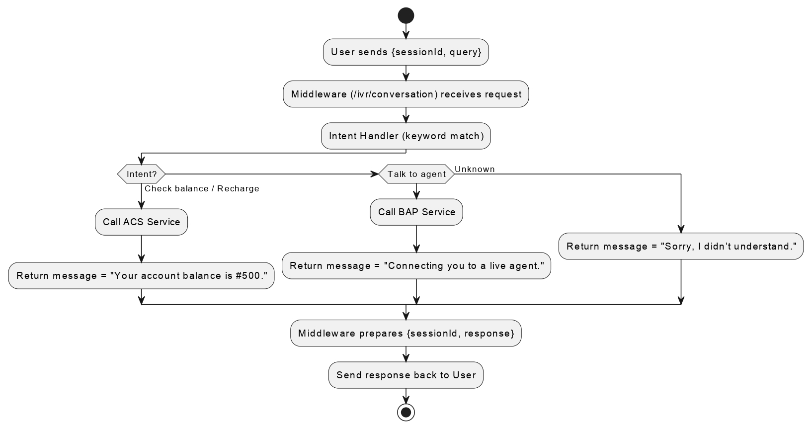

# IVR Modernization Middleware – Milestone 3

## Team-B Members

  * Ramya Inavolu
  * Seshwar Bheemineni
  * Sujal Rane
  * Pati Veera Surya Umanjani
  * Thrupthi Chandana G
  * Uma Maheswari Naidu
  * Varshitha Kolla
  * Joise S Arakkal
  * Parasaram Neha Sri
  * Alankrith
  * Laasya

## Introduction

**Goal:** Modernize a legacy IVR system by integrating it with modern ACS (Account Control Service) and BAP (Basic Agent Proxy) services.

**Milestone 3:** This milestone enhances the Node.js middleware by adding a conversational AI layer. The system can now understand natural language queries, determine user intent, and route requests to the appropriate service, moving beyond simple digit-based DTMF inputs.

-----

## System Architecture & Conversational Flow

The architecture now supports a dual-input system. A user can interact with the IVR through traditional DTMF tones (digits) or by using natural language (speech-to-text). The Node.js middleware intelligently processes both types of input and routes them to the correct backend service (ACS or BAP).

### Conversational Flow Diagram



-----

## Setup and Installation

### Prerequisites

  * **Node.js**: Required to run the middleware server.
  * **npm**: The Node.js package manager, used for installing dependencies.
  * **Thunder Client** (or any API testing tool): A VS Code extension used for testing API endpoints.

### Installation Steps

**Step 1: Clone the Repository**

```bash
git clone https://github.com/springboardmentor545-lgtm/TeamB-IVR-Modernization.git
cd TeamB-IVR-Modernization/middleware-project
```

**Step 2: Install Dependencies**

```bash
npm install
```

**Step 3: Start the Server**

To start the server, you can use `npm start` or run `nodemon` for automatic reloading during development.

Using nodemon:

```bash
npx nodemon index.js
```

The server will be running at `http://localhost:3000`.

### Folder Structure

```
middleware-project/
├── package.json               
├── index.js                   
├── test-intent.js             
│
├── /routes                    # API endpoint definitions
│   ├── ivrRoutes.js           
│   ├── acsRoutes.js           
│   └── bapRoutes.js           
│
├── /controllers               # Logic for handling incoming requests
│   ├── ivrController.js       
│   ├── conversationController.js 
│   ├── acsController.js       
│   └── bapController.js       
│
├── /services                  # Core business logic and service simulations
│   ├── intentService.js      
│   ├── acsService.js          
│   └── bapService.js          
│
├── /docs
│   └── API.md                 
│   └── README.md    
              
```

### System Setup – Execution Guide

Ensure Node.js and npm are installed. Check with:

```bash
node -v
npm -v
```

1. Navigate to project directory:

   ```bash
   cd path/to/your/project-directory
   ```

2. Install dependencies:

   ```bash
   npm install
   ```

3. Start middleware server:

   ```bash
   nodemon index.js
   ```

   or

   ```bash
   npx nodemon index.js
   ```

4. Server runs on: http://localhost:3000/

-----
## API Documentation

The middleware now exposes two primary endpoints under the `/ivr` route to handle both traditional and modern user inputs.

### 1\. Endpoint: `/ivr/request` (DTMF Digit Input)

This endpoint processes traditional digit-based inputs from the IVR system.

  * **Method:** `POST`
  * **URL:** `http://localhost:3000/ivr/request`
  * **Description:** Receives a user's digit input, validates it, and routes the request to either the ACS or BAP service.

#### Request Body

```json
{
  "sessionId": "abc123",
  "digit": "1"
}
```

#### Success Response (Balance Inquiry)

```json
{
  "sessionId": "abc123",
  "response": "Your account balance is ₹500."
}
```

-----

### 2\. Endpoint: `/ivr/conversation` (Natural Language Input)

This new endpoint processes natural language queries, allowing for a more intuitive user experience.

  * **Method:** `POST`
  * **URL:** `http://localhost:3000/ivr/conversation`
  * **Description:** Takes a natural language query from the user, uses the `intentService` to determine the user's intent, and routes the request to the appropriate service.

#### Request Body

| Field       | Type   | Required | Description                               |
| :---------- | :----- | :------- | :---------------------------------------- |
| `sessionId` | String | Yes      | A unique identifier for the call session. |
| `query`     | String | Yes      | The natural language query from the user. |

**Example Request:**

```json
{
  "sessionId": "abc123",
  "query": "I want to check my account balance"
}
```

#### Supported Intents

The `intentService.js` file contains the logic for mapping keywords to specific intents:

| Intent             | Example Queries                                  | Service | Digit |
| :----------------- | :----------------------------------------------- | :------ | :---- |
| `balance_inquiry`  | "check balance", "what's my balance?"            | ACS     | 1     |
| `recharge_account` | "recharge my account", "top up my phone"         | ACS     | 2     |
| `agent_support`    | "talk to an agent", "I need customer support"    | BAP     | 3     |

#### Success Responses

  * **Case 1: Balance Inquiry**
    ```json
    {
      "sessionId": "abc123",
      "intent": "balance_inquiry",
      "response": "Your account balance is ₹500."
    }
    ```
  * **Case 2: Agent Support Request**
    ```json
    {
      "sessionId": "abc123",
      "intent": "agent_support",
      "response": "Connecting you to a live agent. Please hold while we transfer your call. Your estimated wait time is 2 minutes."
    }
    ```

#### Error Response (Unrecognized Intent)

If the user's query cannot be mapped to a known intent, the API will return an error.

  * **Status Code:** `400 Bad Request`
  * **Response Body:**
    ```json
    {
      "error": "Unable to understand your request",
      "suggestion": "Try asking about 'check balance', 'recharge account', or 'talk to agent'"
    }
    ```

-----

## Project Contribution

| Section                              | Person                  |
|--------------------------------------|-------------------------|
| Project Demo                         | Alankrith               |
| Title & Team Details + Formatting    | Joise S Arakkal         |
| Objective of Milestone 2 + Introduction | Thrupthi Chandana G     |
| Architecture Diagram                 | Seshwar Bheemineni      |
| Testing Middleware                   | Varshitha Kolla         |
| System Setup (Installation Guide)    | Uma Maheshwari Naidu    |
| System Setup (Execution Guide)       | Pati Veera Surya Umanjani |
| API Documentation – IVR Endpoints    | Parasaram Neha Sri      |
| API Documentation – ACS Endpoints    | Ramya Inavolu           |
| Team Task Division + Challenges      | Byreddy Lasya Sre Reddy |
| Learnings + Conclusion + Future Scope| Sujal Rane              |

## Challenges

- Setting up Express.js server with proper routes
- Handling Axios API calls & managing async responses
- Debugging CORS issues
- Structuring project into modular format
- Managing error handling for failed API requests

## Learnings

- Understood how middleware connects and processes requests
- Importance of modular structure for scalability
- Gained deeper understanding of async programming
- Learned to configure CORS
- Improved collaboration using Git

## Conclusion

Through the development of the middleware for IVR Modernization, our team gained both technical and collaborative learnings that proved highly valuable. On the technical side, we understood the crucial role of middleware as the bridge between legacy IVR systems built on VXML and modern conversational AI platforms such as ACS and BAP. The project reinforced the importance of well-defined API communication, where structured request and response formats ensure seamless interoperability.

Working with Node.js and Express gave us hands-on experience in asynchronous programming, routing, and modular application design. By organizing the project into routes, controllers, and services, we ensured maintainability and scalability. The use of Axios for API calls highlighted the importance of error handling, retries, and resilience in systems that depend on external services. Testing with Thunder Client helped us validate not only the correctness of the API flows but also the importance of capturing both success and error scenarios to improve robustness.

Collaboration was another major learning. By dividing the middleware into modules, each team member contributed meaningfully to the project while also understanding how their part interacted with the larger system. This improved our coordination, communication, and collective problem-solving skills. We realized that building middleware is not only a coding task but also about aligning multiple perspectives into a cohesive solution.

In terms of outcomes, Milestone 2 successfully demonstrated that requests from IVR can be routed through the middleware, processed by mock ACS/BAP services, and returned with meaningful responses. This validated our design and proved that modernization of legacy IVR systems is achievable without replacing existing infrastructure. By the end of this milestone, we had a working middleware with modular architecture, mock endpoints, and clear API documentation — establishing a strong foundation for further development.

Looking forward, the next milestone will involve integrating with real ACS/BAP platforms, which will introduce authentication, live conversational flows, and stronger security requirements. Performance and scalability will become a priority, ensuring that the middleware can handle production-level workloads with low latency. We also aim to enhance error handling, add monitoring and logging features, and strengthen dialogue flow mapping for more natural user experiences. In the long run, this middleware framework can evolve into a versatile solution that supports multiple AI platforms, enabling enterprises to modernize their IVR systems with flexibility and minimal redevelopment.

Overall, this milestone has not only validated the feasibility of IVR modernization via middleware but also enriched our understanding of real-world system integration. It has given us the confidence and technical grounding to move toward a production-ready solution in the upcoming phases.
