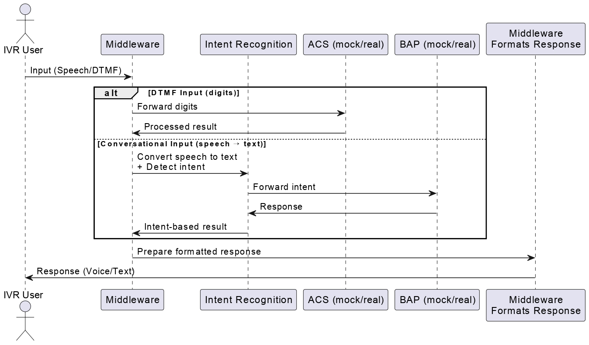

# IVR Modernization Middleware – Milestone 3

## Team-B Members

  * Ramya Inavolu
  * Seshwar Bheemineni
  * Sujal Rane
  * Pati Veera Surya Umanjani
  * Thrupthi Chandana G
  * Uma Maheswari Naidu
  * Varshitha Kolla
  * Joise S Arakkal
  * Parasaram Neha Sri
  * Alankrith
  * Laasya

## Introduction

**Goal:** Modernize a legacy IVR system by integrating it with modern ACS and BAP services.

**Milestone 3:** This milestone enhances the Node.js middleware by adding a conversational AI layer. The system can now understand natural language queries, determine user intent, and route requests to the appropriate service, moving beyond simple digit-based DTMF inputs.

-----

## System Architecture & Conversational Flow

The architecture now supports a dual-input system. A user can interact with the IVR through traditional DTMF tones (digits) or by using natural language (speech-to-text). The Node.js middleware intelligently processes both types of input and routes them to the correct backend service (ACS or BAP).

### Conversational Flow Diagram



-----

## Setup and Installation

### Prerequisites

  * **Node.js**: Required to run the middleware server.
  * **npm**: The Node.js package manager, used for installing dependencies.
  * **Thunder Client** (or any API testing tool): A VS Code extension used for testing API endpoints.

### Installation Steps

**Step 1: Clone the Repository**

```bash
git clone https://github.com/springboardmentor545-lgtm/TeamB-IVR-Modernization.git
cd TeamB-IVR-Modernization/middleware-project
```

**Step 2: Install Dependencies**

```bash
npm install
```

**Step 3: Start the Server**

To start the server, you can use `npm start` or run `nodemon` for automatic reloading during development.

Using nodemon:

```bash
npx nodemon index.js
```

The server will be running at `http://localhost:3000`.

### Folder Structure

```
middleware-project/
├── package.json               
├── index.js                   
├── test-intent.js             
│
├── /routes                    # API endpoint definitions
│   ├── ivrRoutes.js           
│   ├── acsRoutes.js           
│   └── bapRoutes.js           
│
├── /controllers               # Logic for handling incoming requests
│   ├── ivrController.js       
│   ├── conversationController.js 
│   ├── acsController.js       
│   └── bapController.js       
│
├── /services                  # Core business logic and service simulations
│   ├── intentService.js      
│   ├── acsService.js          
│   └── bapService.js          
│
├── /docs
│   └── API.md                 
│   └── README.md    
              
```

### System Setup – Execution Guide

Ensure Node.js and npm are installed. Check with:

```bash
node -v
npm -v
```

1. Navigate to project directory:

   ```bash
   cd path/to/your/project-directory
   ```

2. Install dependencies:

   ```bash
   npm install
   ```

3. Start middleware server:

   ```bash
   nodemon index.js
   ```

   or

   ```bash
   npx nodemon index.js
   ```

4. Server runs on: http://localhost:3000/

-----
## API Documentation

The middleware now exposes two primary endpoints under the `/ivr` route to handle both traditional and modern user inputs.

### 1\. Endpoint: `/ivr/request` (DTMF Digit Input)

This endpoint processes traditional digit-based inputs from the IVR system.

  * **Method:** `POST`
  * **URL:** `http://localhost:3000/ivr/request`
  * **Description:** Receives a user's digit input, validates it, and routes the request to either the ACS or BAP service.

#### Request Body

```json
{
  "sessionId": "abc123",
  "digit": "1"
}
```

#### Success Response (Balance Inquiry)

```json
{
  "sessionId": "abc123",
  "response": "Your account balance is ₹500."
}
```

-----

### 2\. Endpoint: `/ivr/conversation` (Natural Language Input)

This new endpoint processes natural language queries, allowing for a more intuitive user experience.

  * **Method:** `POST`
  * **URL:** `http://localhost:3000/ivr/conversation`
  * **Description:** Takes a natural language query from the user, uses the `intentService` to determine the user's intent, and routes the request to the appropriate service.

#### Request Body

| Field       | Type   | Required | Description                               |
| :---------- | :----- | :------- | :---------------------------------------- |
| `sessionId` | String | Yes      | A unique identifier for the call session. |
| `query`     | String | Yes      | The natural language query from the user. |

**Example Request:**

```json
{
  "sessionId": "abc123",
  "query": "I want to check my account balance"
}
```

#### Supported Intents

The `intentService.js` file contains the logic for mapping keywords to specific intents:

| Intent             | Example Queries                                  | Service | Digit |
| :----------------- | :----------------------------------------------- | :------ | :---- |
| `balance_inquiry`  | "check balance", "what's my balance?"            | ACS     | 1     |
| `recharge_account` | "recharge my account", "top up my phone"         | ACS     | 2     |
| `agent_support`    | "talk to an agent", "I need customer support"    | BAP     | 3     |

#### Success Responses

  * **Case 1: Balance Inquiry**
    ```json
    {
      "sessionId": "abc123",
      "intent": "balance_inquiry",
      "response": "Your account balance is ₹500."
    }
    ```
    .png?raw=true)

  * **Case 2: Agent Support Request**
    ```json
    {
      "sessionId": "abc123",
      "intent": "agent_support",
      "response": "Connecting you to a live agent. Please hold while we transfer your call. Your estimated wait time is 2 minutes."
    }
    ```
    .png?raw=true)

#### Error Response (Unrecognized Intent)

If the user's query cannot be mapped to a known intent, the API will return an error.

  * **Status Code:** `400 Bad Request`
  * **Response Body:**
    ```json
    {
      "error": "Unable to understand your request",
      "suggestion": "Try asking about 'check balance', 'recharge account', or 'talk to agent'"
    }
    ```
    .png?raw=true)

-----

## Project Contribution

| Section                              | Person                  |
|--------------------------------------|-------------------------|
| Project Demo                         | Alankrith               |
| Title & Team Details + Formatting    | Joise S Arakkal         |
| Objective of Milestone 2 + Introduction | Thrupthi Chandana G     |
| Architecture Diagram                 | Seshwar Bheemineni      |
| Testing Middleware                   | Varshitha Kolla         |
| System Setup (Installation Guide)    | Uma Maheshwari Naidu    |
| System Setup (Execution Guide)       | Pati Veera Surya Umanjani |
| API Documentation – IVR Endpoints    | Parasaram Neha Sri      |
| API Documentation – ACS Endpoints    | Ramya Inavolu           |
| Team Task Division + Challenges      | Byreddy Lasya Sre Reddy |
| Learnings + Conclusion + Future Scope| Sujal Rane              |

## Challenges

- Setting up Express.js server with proper routes
- Handling Axios API calls & managing async responses
- Debugging CORS issues
- Structuring project into modular format
- Managing error handling for failed API requests
- Unrecognized Intent

## Learnings

- Understood how middleware connects and processes requests
- Importance of modular structure for scalability
- Gained deeper understanding of async programming
- Learned to configure CORS
- Improved collaboration using Git
- Simple NLP libraries

## Conclusion and Next Steps

Milestone 3 introduces conversational AI capabilities into the IVR system, enabling real-time natural language interaction alongside traditional DTMF inputs. This milestone significantly enhances the user experience by modernizing dialogue handling and integrating conversational flows into the existing system architecture. The `/ivr/conversation` endpoint, coupled with the `intentService`, provides a streamlined mechanism for intent detection and backend routing, laying the groundwork for a flexible and user-friendly IVR platform.

With Milestone 3 completed, the project is now positioned to move into **Milestone 4: Testing and Deployment**. This will focus on validating performance, ensuring end-to-end flow accuracy, and preparing the modernized IVR for production rollout.

**Future Scope:**

  * **Integration with Real AI Platforms:** Transition from mock services to enterprise-grade conversational platforms (e.g., ACS/BAP), incorporating secure authentication and advanced flow handling.
  * **Enhanced NLU:** Improve the intent detection engine to better handle diverse user queries, contextual understanding, and multi-turn dialogues.
  * **Robust Testing and Monitoring:** As part of Milestone 4, implement extensive testing, logging, and monitoring to ensure reliable performance in real-world conditions.

